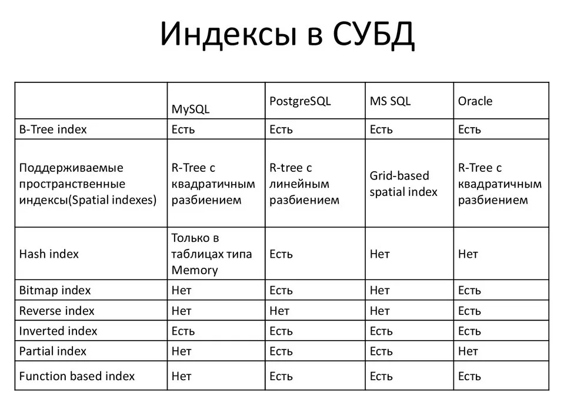

# Индексы в СУБД

### B-Tree

B-tree (сбалансированное дерево) — это самый распространенный тип индекса в PostgreSQL. Он поддерживает все стандартные операции сравнения (>, <, >=, <=, =, <>) и может использоваться с большинством типов данных. B-tree индексы могут быть использованы для сортировки, ограничений уникальности и поиска по диапазону значений.

Пример \
`CREATE INDEX ix_example_btree ON example_table (column_name);`

### Hash 

Hash-индексы предназначены для обеспечения быстрого доступа к данным по равенству. Они менее эффективны, чем B-tree индексы, и не поддерживают сортировку или поиск по диапазону значений. Из-за своих ограничений, Hash-индексы редко используются на практике.

Пример:\
`CREATE INDEX ix_example_hash ON example_table USING hash (column_name);`

### GiST (Generalized Search Tree)

GiST-индексы являются обобщенными и многоцелевыми, предназначены для работы с сложными типами данных, такими как геометрические объекты, текст и массивы. Они позволяют быстро выполнять поиск по пространственным, текстовым и иерархическим данным.

Пример:\
`CREATE INDEX ix_example_gist ON example_table USING gist (to_tsvector('english', column_name));`

### SP-GiST (Space-Partitioned Generalized Search Tree)

SP-GiST индексы предназначены для работы с непересекающимися и неравномерно распределенными данными. Они эффективны для поиска в геометрических и IP-адресных данных.

### GIN (Generalized Inverted Index)

GIN-индексы применяются для полнотекстового поиска и поиска по массивам, JSON и триграммам. Они обеспечивают высокую производительность при поиске в больших объемах данных.

Пример:\
`CREATE INDEX ix_example_gin ON example_table USING gin (to_tsvector('english', column_name));`

### BRIN (Block Range INdex)

BRIN-индексы используются для компактного представления больших объемов данных, особенно когда значения в таблице имеют определенный порядок. Они эффективны для хранения и обработки временных рядов и географических данных.

### Bloom

### Bitmap Index Scan
Сканируйте индекс и создайте растровое изображение. Растровое изображение — это массив битов, который показывает, какую страницу следует загрузить. Сначала PostgreSQL просканирует индекс, чтобы найти значения, соответствующие условию, а затем установит бит на соответствующей странице растрового изображения в 1.